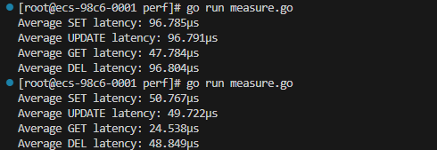

# 实验16：基于 eBPF 内核拓展的应用加速

## 环境
### 使用 QEMU 启动 EulixOS
由于启动需要使用 uboot.elf，所以需要先在 riscv 下编译 uboot。
基于 openeuler 24.03 LTS。
#### RISC-V GCC 交叉编译工具链安装
首先需要克隆仓库：
```shell
git clone https://gitee.com/riscv-mcu/riscv-gnu-toolchain.git
```

这里采用 gitee 上同步的 github 仓库，因为直接克隆 github 仓库太慢。

> 这里存在一个问题，即 llvm 仓库由于太大被屏蔽而无法克隆，因此这里需要局部更新子模块，最后将 llvm 下载并复制到项目中：\
cd riscv-gnu-toolchain \
局部更新子模块：\
git submodule init [子模块相对路径] \
git submodule update --recursive [子模块相对路径]

```shell
items=(glibc gcc gdb dejagnu musl llvm newlib pk qemu spike)

for i in ${items[@]}
do
    if [ ${i} != "llvm" ]
    then
        git submodule init ${i}
        git submodule update --recursive ${i}
    fi
done

git submodule init llvm
```
随后开始编译：
```shell
mkdir build && cd build
../configure --prefix=${PWD}/riscv64-linux
make linux -j4		# 指定 linux 目标来编译 glibc 版本
```
最终编译完成的可执行文件在 riscv64-linux/bin 中：


#### 编译 u-boot
克隆 u-boot 仓库：
```shell
git clone https://github.com/u-boot/u-boot.git
cd u-boot
ls configs
```
选定对应的 qemu-riscv 配置：


选择其中的 qemu-riscv64_smode_defconfig，并指定交叉编译工具链运行如下命令编译：

```shell
make ARCH=riscv CROSS_COMPILE=riscv64-unknown-linux-gnu- qemu-riscv64_smode_defconfig
make ARCH=riscv CROSS_COMPILE=riscv64-unknown-linux-gnu- -j$(nproc)
```

注意这里 CROSS_COMPILE 要与上面图中交叉编译工具链的前缀相同，即 riscv64-unknown-linux-gnu-gcc 的 riscv64-unknown-linux-gnu-，后面不能加上 gcc。

> 这里注意可能会出现如下报错：\
gnutls/gnutls.h: No such file or directory \
这是因为缺少了 gnutls 开发包，安装上即可：\
dnf install gnutls-devel -y

编译完成后会生成如下两个可执行文件：


我们需要其中第一个 u-boot 文件来引导系统启动，这是一个 elf 文件。
#### 通过 QCOW2 镜像启动系统
由于需要虚拟机之间通信，因此这里设置 TAP 接口满足这一需求。创建两个 TAP 接口 tap0 并启用。
创建 TAP 接口：
```shell
ip tuntap add dev tap0 mode tap user $(whoami)
ip link set tap0 up
ip tuntap add dev tap1 mode tap user $(whoami)
ip link set tap1 up
```

关闭主机的防火墙：
```shell
systemctl stop firewalld
```
设置主机进行 NAT 转发，使得虚拟机能够访问外网，并将转发规则持久化：
```shell
iptables -t nat -A POSTROUTING -s 10.0.3.0/24 -o enp0s3 -j MASQUERADE
iptables -t nat -A POSTROUTING -s 10.0.4.0/24 -o enp0s3 -j MASQUERADE
sysctl -w net.ipv4.ip_forward=1
service iptables save
```

启动两台虚拟机：
server：
```shell
qemu-system-riscv64 \
    -machine virt \
    -nographic \
    -m 4096M \
    -cpu rv64 \
    -smp 3
    -kernel /root/u-boot/u-boot \
    -bios /usr/share/qemu/opensbi-riscv64-generic-fw_dynamic.bin \
    -drive file=./EulixOS-3.0.qcow2,if=none,format=qcow2,id=hd0 \
    -device virtio-blk-device,drive=hd0 \
    -netdev tap,id=mynet0,ifname=tap0,script=no,downscript=no \
    -device virtio-net-device,netdev=mynet0,mac=52:54:00:12:34:56 \
    -append "root=LABEL=rootfs console=ttyS0"
```
test:
```shell
qemu-system-riscv64 \
    -machine virt \
    -nographic \
    -m 4096M \
    -cpu rv64 \
    -smp 3
    -kernel /root/u-boot/u-boot \
    -bios /usr/share/qemu/opensbi-riscv64-generic-fw_dynamic.bin \
    -drive file=./EulixOS-3.0.qcow2,if=none,format=qcow2,id=hd0 \
    -device virtio-blk-device,drive=hd0 \
    -netdev tap,id=mynet0,ifname=tap1,script=no,downscript=no \
    -device virtio-net-device,netdev=mynet0,mac=52:54:00:12:34:57 \
    -append "root=LABEL=rootfs console=ttyS0"
```
两台虚拟机只有使用的 tap 接口和 MAC 地址不同。
* `-machine virt`：指定 QEMU 模拟的 RISC-V 平台。
* `-nographic`：不启动图形界面，所有输出将显示在终端。
* `-m 4096M`：为虚拟机分配 4GB 内存。
* `-cpu rv64`：指定 CPU 类型为 RV64
* `-smp 3`：指定核心数为 3。
* `-kernel`：引导文件的路径，这里使用 u-boot 编译生成的 RISC-V 下的引导文件 u-boot.elf。
* `-bios`：这里指定了 qemu 自带的 OpenSBI 固件，用于将 RISC-V 平台在 M-Mode 和 S-Mode 中切换。
* `-kernel /root/u-boot/u-boot`：编译 u-boot 生成的引导文件，用于引导内核。
* `-drive file=./EulixOS-3.0.qcow2,if=none,format=qcow2,id=hd0`：指定操作系统镜像。
* `-device virtio-blk-device,drive=hd0`：挂载磁盘镜像。
* `-netdev tap,id=mynet0,ifname=tap0,script=no,downscript=no`：将 TAP 接口与虚拟机的网络设备连接。
* `-device virtio-net-device,netdev=mynet0,mac=52:54:00:12:34:56`：指定虚拟机的网络设备类型和 mac 地址，其中 mac 地址必须手动指定，不然启动虚拟机后两个虚拟机分配的 ip 地址是相同的。

经历一段启动过程后，出现登录界面：


登录后进入系统，首先给虚拟机分配 ip：

编辑 `/etc/sysconfig/network-scripts/ifcfg-eth0`：

```
BOOTPROTO=static
IPADDR=10.0.3.15	# 这里 test 是 10.0.4.15
NETMASK=255.255.255.0
GATEWAY=10.0.3.56   # 网关，这里应该是 tap 接口的 ip。test 配置成 10.0.4.56
```
随后重启虚拟机网络：
```shell
systemctl daemon-reload
systemctl restart NetworkManager
```

随后退出给 tap0 和 tap1 分配 ip：

```shell
ifconfig tap0 10.0.3.56
ifconfig tap1 10.0.4.56
```

* **系统**：服务端和测试端均为 EulixOS 3.0
* IP 地址：
  * 服务端：10.0.3.15/24
  * 测试端：10.0.4.15/24
* 配置：测试端和服务端均为 3 核 4G 内存

**添加 DNS 记录**

在 /etc/hosts 里添加记录方便使用别名：

```
10.0.3.15 server
10.0.4.15 test
```

**安装 eBPF 环境**（服务端和测试端）：

```shell
dnf update -y
dnf install clang llvm bcc kernel-headers -y
```

**服务端 hello world：**

test_hello_world.c：

```c
int hello_world(struct pt_regs *ctx) {
    bpf_trace_printk("Hello world from eBPF!\n");
    return 0;
}
```

test_hello_world.py：

```python
from bpfcc import BPF

bpf_program = open("test_hello_world.c", "r").read()
print(type(bpf_program))

b = BPF(text=bpf_program)
syscall = b.get_syscall_fnname("read")
b.attach_kprobe(event=syscall, fn_name="hello_world")

print("eBPF program loaded.")
b.trace_print()
```

运行结果：


**测试端采集数据**：

简单的负载代码：

```python
from time import sleep

if __name__ == '__main__':
    while True:
        print("exec!")
        sleep(1)
```

test.py：

```python
import paramiko
import os
from time import sleep

# 服务端信息
SERVICE_IP = "server"  # 服务端 IP 地址
SERVICE_USER = "root"         # 服务端 SSH 用户
SERVICE_PASS = "Liu20021231" # 服务端 SSH 密码
DURATION = 10           # 信息采集持续时间，单位为秒

def test():
    try:
        client = paramiko.SSHClient()
        client.set_missing_host_key_policy(paramiko.AutoAddPolicy())
        client.connect(hostname=SERVICE_IP, port=22, username=SERVICE_USER, password=SERVICE_PASS)
        
        # 获取进程 PID
        stdin, stdout, stderr = client.exec_command("pgrep -f workload.py")
        pid = stdout.read().decode('utf-8')

        # 调用终端
        shell = client.invoke_shell()

        # 查看堆栈追踪
        command = f"cd /{SERVICE_USER}/os-work && perf record -e sched:sched_switch -p {pid} -a sleep {DURATION}"
        print(f"Running command on server: {command}")
		# 运行命令
        shell.send(command + '\n')
		# 等待 perf 采集数据，并留出一秒作为冗余
        sleep(DURATION + 1)

        sftp = client.open_sftp()

        sftp.get(f"/{SERVICE_USER}/os-work/perf.data", "perf.data")
        os.system("perf script")

        shell.close()
        client.close()
    except Exception as e:
        print(f"Error collecting data: {e}")

if __name__ == "__main__":
    test()
```

使用 paramiko 库在服务端运行 perf 命令生成 perf.data 后，将 perf.data 数据通过 SFTP 传回测试端，随后在测试端通过 perf script 展示数据。测试得到测试端可采集服务端负载数据。
运行结果：


## 基于eBPF的性能分析
### 使用bpftrace分析redis
跟踪所有系统调用
```
sudo bpftrace -e '
tracepoint:syscalls:sys_enter_* /comm == "redis-server"/ {
    @[probe] = count();
}' > redis_trace.out

```

跟踪所有函数调用
```
sudo -E stdbuf -oL bpftrace --unsafe -e '
uprobe:/usr/local/bin/redis-server:* {
    @[func] = count();
    
}

interval:s:10 {
    print(@);
    clear(@);
}

END {
    print(@);
}
' > redis_function_trace.out
```

列出可用的 uprobe 探针
`sudo bpftrace -l 'uprobe:/usr/local/bin/redis-server:*'`

### 使用perf工具分析
```sh
# 1. 执行 Redis 基准测试
redis-benchmark -h 192.168.0.215 -p 6379 -t set,get -n 1000000 -c 50 -d 64

# 2. 启动程序收集函数调用信息，并绘制火焰图
python3 test_redis.py
```

`test_redis.py：`
```python
import paramiko
import os
from time import sleep

# 服务端信息
SERVICE_IP = "server"  # 服务端 IP 地址
SERVICE_USER = "root"         # 服务端 SSH 用户
SERVICE_PASS = "Liu20021231" # 服务端 SSH 密码
DURATION = 30           # 信息采集持续时间，单位为秒

def test():
    try:
        client = paramiko.SSHClient()
        client.set_missing_host_key_policy(paramiko.AutoAddPolicy())
        client.connect(hostname=SERVICE_IP, port=22, username=SERVICE_USER, password=SERVICE_PASS)

        # 启动 perf 记录 Redis 进程的性能数据
        # 需要先确认 Redis 进程的 PID
        stdin, stdout, stderr = client.exec_command("pgrep redis-server")

        # 获得 redis-server 的 pid
        redis_pid = stdout.read().decode('utf-8')
        if redis_pid is None or redis_pid == "":
            # 如果没有 Redis 进程 PID，返回
            print("No Redis process found, exiting...")
            return

        shell = client.invoke_shell()

        # 使用 perf 工具记录 Redis 进程的性能数据，监控调用栈
        command = f"perf record -p {redis_pid.strip()} -F 200 -g sleep {DURATION}"
        print(f"Running command on server: {command}")

        shell.send(command + '\n')

        sleep(DURATION + 1)

        sftp = client.open_sftp()

        sftp.get("perf.data", "perf.data")
        sftp.close()
        shell.close()
        client.close()
        os.system("perf script > perf.out")

        os.system("/root/FlameGraph/stackcollapse-perf.pl perf.out > perf.folded")
        os.system("/root/FlameGraph/flamegraph.pl perf.folded > flamegraph.svg")

    except Exception as e:
        print(f"Error processing: {e}")

if __name__ == "__main__":
    test()
```

输出结果


### 基于eBPF监测redis各个操作的延迟
代码位于`redis-ebpf-analysis`文件夹下

**构建运行**
```sh
go generate
go build
sudo ./redis
```

**使用以下方式检查 eBPF 程序日志**
```sh
sudo cat /sys/kernel/debug/tracing/trace_pipe
```
**程序输出**
```
2024/12/25 08:45:44 set name os-work, Latency: 3696 ns
2024/12/25 08:45:44 get name, Latency: 4849 ns
2024/12/25 08:45:44 del name, Latency: 5866 ns
2024/12/25 08:45:44 set name linzhicheng, Latency: 2940 ns
2024/12/25 08:45:44 set name os-work, Latency: 4374 ns
2024/12/25 08:45:44 get name, Latency: 6298 ns
2024/12/25 08:45:44 del name, Latency: 3752 ns
```

### redis-ebpf-analysis——Redis 监控系统设计文档

#### 1. 项目概述
本项目旨在实现一个Redis监控系统，能够捕获和分析Redis相关的系统调用，识别Redis协议的请求和响应，并提供相应的监控信息，如请求方法、延迟等。项目主要包含Go语言编写的用户态程序和eBPF程序，两者通过共享映射进行通信。

#### 2. 功能需求
##### 2.1. 系统调用捕获
- 拦截并处理与Redis相关的 `write` 和 `read` 系统调用。
- 在系统调用进入和退出时进行相应的处理，记录必要的信息。

##### 2.2. Redis协议解析
- 识别Redis协议中的不同数据类型，如简单字符串、错误、整数、批量字符串和数组。
- 解析Redis命令、推送事件、PING请求等，并提取相关信息。

##### 2.3. 监控信息输出
- 输出Redis请求的方法（如COMMAND、PUSHED_EVENT、PING）。
- 计算并输出请求的延迟时间（从写入到读取完成的时间间隔）。
- 以可读的格式打印Redis协议中的数据内容。

**输出内容如下：**


#### 3. 模块设计
##### 3.1. 用户态程序（Go语言）
###### 3.1.1. 资源管理模块
- 负责允许当前进程锁定eBPF资源的内存，确保程序能够正常加载和运行eBPF程序。
- 加载预编译的eBPF程序和映射到内核中，建立用户态和内核态之间的通信基础。

###### 3.1.2. 系统调用跟踪模块
- 使用 `link.Tracepoint` 函数，在 `syscalls/sys_enter_write`、`syscalls/sys_exit_write`、`syscalls/sys_enter_read` 和 `syscalls/sys_exit_read` 等系统调用点进行跟踪。
- 为每个跟踪点注册相应的处理函数，如 `pgObjs.HandleWrite`、`pgObjs.HandleWriteExit`、`pgObjs.HandleRead` 和 `pgObjs.HandleReadExit`。

###### 3.1.3. 事件处理模块
- 从内核通过 `perf` 事件获取L7事件信息，使用 `perf.NewReader` 函数创建事件读取器，从 `pgObjs.L7Events` 映射中读取数据。
- 解析读取到的事件数据，判断协议类型是否为Redis。如果是，则进一步解析Redis协议内容，提取请求方法、参数等信息。
- 计算并输出请求的延迟时间，以及将Redis协议中的数据转换为可读字符串并打印输出。

##### 3.2. eBPF程序（C语言）
###### 3.2.1. 数据结构定义
- 定义了一系列用于存储系统调用参数、请求和事件信息的数据结构，如 `write_args`、`read_args`、`socket_key`、`l7_request` 和 `l7_event` 等。
- 这些结构用于在内核态记录系统调用的相关信息，以及在用户态和内核态之间传递数据。

###### 3.2.2. 系统调用处理函数
- `process_enter_of_syscalls_write`：处理 `write` 系统调用进入时的操作。从映射中获取或初始化 `l7_request` 结构，检查并设置Redis协议相关信息（如协议类型、方法），复制有效载荷，更新活动请求映射。
- `process_exit_of_syscalls_write`：处理 `write` 系统调用退出时的操作。根据返回值判断写入是否成功，若成功则填充 `l7_event` 结构并通过 `bpf_perf_event_output` 将事件发送到用户空间。
- `process_enter_of_syscalls_read`：处理 `read` 系统调用进入时的操作。记录读取参数到 `active_reads` 映射中。
- `process_exit_of_syscalls_read`：处理 `read` 系统调用退出时的操作。从映射中获取相关信息，检查是否为Redis推送事件，若不是则从活动请求中获取信息，填充 `l7_event` 结构，根据读取结果设置状态，最后将事件发送到用户空间。

###### 3.2.3. 辅助函数
- `is_redis_ping`、`is_redis_pong`、`is_redis_command` 和 `is_redis_pushed_event`：用于识别Redis协议中的特定命令或事件。
- `parse_redis_response`：解析Redis响应的状态。

#### 4. 数据结构设计
##### 4.1. 用户态数据结构（Go语言）
###### 4.1.1. `L7Event` 结构体
- 用于在用户态表示L7层事件，包含了文件描述符（`Fd`）、进程ID（`Pid`）、状态（`Status`）、持续时间（`Duration`）、协议类型（`Protocol`）、是否加密（`Tls`）、方法（`Method`）、有效载荷（`Payload`）、有效载荷大小（`PayloadSize`）、有效载荷是否读取完整（`PayloadReadComplete`）、是否失败（`Failed`）、写入时间（`WriteTimeNs`）、线程ID（`Tid`）、序列号（`Seq`）和事件读取时间（`EventReadTime`）等字段。

###### 4.1.2. `bpfL7Event` 结构体
- 与内核态的事件结构相对应，用于从内核读取事件数据时进行转换。包含类似的字段，但类型和命名可能有所不同，以适配内核态和用户态之间的数据交互。

###### 4.1.3. `RedisValue` 接口
- 用于表示Redis协议中解析出的值，具体类型可以是字符串、整数或Redis值的数组。

##### 4.2. 内核态数据结构（C语言）
###### 4.2.1. `write_args` 结构体
- 存储 `write` 系统调用的参数，包括文件描述符（`fd`）、缓冲区指针（`buf`）、写入大小（`size`）和写入开始时间（`write_start_ns`）。
```c
struct write_args {
    __u64 fd;
    char* buf;
    __u64 size;
    __u64 write_start_ns;
};
```
###### 4.2.2. `read_args` 结构体
- 存储 `read` 系统调用的参数，包括文件描述符（`fd`）、缓冲区指针（`buf`）、读取大小（`size`）和读取开始时间（`read_start_ns`）。
```c
struct read_args {
    __u64 fd;
    char* buf;
    __u64 size;
    __u64 read_start_ns;  
};
```
###### 4.2.3. `socket_key` 结构体
- 用于作为映射的键，包含文件描述符（`fd`）、进程ID（`pid`）和是否加密（`is_tls`）字段。
```c
struct socket_key {
    __u64 fd;
    __u32 pid;
    __u8 is_tls;
};
```
###### 4.2.4. `l7_request` 结构体
- 表示L7层请求，包含写入时间（`write_time_ns`）、协议类型（`protocol`）、方法（`method`）、有效载荷（`payload`）、有效载荷大小（`payload_size`）、有效载荷是否读取完整（`payload_read_complete`）、请求类型（`request_type`）、序列号（`seq`）和线程ID（`tid`）等字段。
```c
struct l7_request {
    __u64 write_time_ns;  
    __u8 protocol;
    __u8 method;
    unsigned char payload[MAX_PAYLOAD_SIZE];
    __u32 payload_size;
    __u8 payload_read_complete;
    __u8 request_type;
    __u32 seq;
    __u32 tid;
};
```
###### 4.2.5. `l7_event` 结构体
- 表示L7层事件，包含文件描述符（`fd`）、写入时间（`write_time_ns`）、进程ID（`pid`）、状态（`status`）、持续时间（`duration`）、协议类型（`protocol`）、方法（`method`）、填充字段（`padding`）、有效载荷（`payload`）、有效载荷大小（`payload_size`）、有效载荷是否读取完整（`payload_read_complete`）、是否失败（`failed`）、是否加密（`is_tls`）、序列号（`seq`）和线程ID（`tid`）等字段。
```c
struct l7_event {
    __u64 fd;
    __u64 write_time_ns;
    __u32 pid;
    __u32 status;
    __u64 duration;
    __u8 protocol;
    __u8 method;
    __u16 padding;
    unsigned char payload[MAX_PAYLOAD_SIZE];
    __u32 payload_size;
    __u8 payload_read_complete;
    __u8 failed;
    __u8 is_tls;
    __u32 seq;
    __u32 tid;
};
```
#### 5. 关键算法与流程
##### 5.1. 系统调用跟踪流程
1. 用户态程序通过 `link.Tracepoint` 函数在指定的系统调用点进行跟踪注册。
2. 当系统调用发生时，内核态的相应处理函数被触发。
3. 处理函数根据系统调用的类型（进入或退出）和参数，执行相应的操作，如记录信息、更新映射或发送事件到用户空间。

##### 5.2. Redis协议解析流程
1. 在处理 `write` 或 `read` 系统调用时，根据有效载荷的前缀判断Redis协议的数据类型。
2. 对于不同的数据类型，使用相应的解析函数（如 `parseSimpleString`、`parseError`、`parseInteger`、`parseBulkString`、`parseArray`）进行解析。
3. 解析出的Redis值通过 `ConvertValueToString` 函数转换为可读字符串，以便输出或进一步处理。

##### 5.3. 事件处理流程
1. 用户态程序从 `perf` 事件读取器中获取内核发送的L7事件数据。
2. 根据事件的协议类型判断是否为Redis事件。
3. 如果是Redis事件，则解析事件中的有效载荷，获取请求方法和参数等信息。
4. 计算请求的延迟时间，并输出请求方法、延迟时间和有效载荷内容。

#### 6. 性能优化
##### 6.1. 内存分配优化
- 在eBPF程序中，由于堆栈空间有限，使用 `BPF_MAP_TYPE_PERCPU_ARRAY` 类型的映射来分配 `l7_request_heap` 和 `l7_event_heap`，避免在堆栈上分配大内存结构，减少栈溢出风险。

##### 6.2. 数据复制优化
- 在复制有效载荷时，使用 `bpf_probe_read` 函数直接从内核空间读取数据，避免不必要的数据拷贝操作，提高效率。

##### 6.3. 映射操作优化
- 在更新和查找映射元素时，合理使用 `BPF_ANY` 标志，减少不必要的映射操作开销。
- 限制映射的最大条目数，如 `active_reads`、`active_l7_requests` 和 `active_writes` 等映射，避免映射过度增长导致性能下降。

#### 7. 测试性能
- 由于使用eBPF检测redis事件，会在一定程度上降低redis的操作执行时间，因此通过perf文件夹中的measure.go测量开启eBPF程序对redis操作的影响。measure.go的主要作用是对 Redis 数据库的基本操作（SET、GET、UPDATE、DELETE）进行性能测试，测量每种操作在多次重复执行后的平均延迟时间。

**测试结果如下：**



**对比图如下：**


**说明：**
- bpf2go是一个用于将 eBPF 程序（通常是用 C 语言编写）转换为 Go 语言代码的工具。在给定的代码中，通过//go:generate go run github.com/cilium/ebpf/cmd/bpf2go redis redis.c这行注释，指示go generate工具运行bpf2go来处理redis.c文件，并生成相应的 Go 代码。

## 基于eBPF的性能加速

实验参考论文**Fast, Flexible, and Practical Kernel Extensions**，并应老师要求，这部分基于其开源代码及说明文档进行原论文的复现实验。实验位于test机器上。

### 1.原理及代码结构

#### 1.1 原理

​	KFlex是一种内核扩展方法，其设计基于一个观察：安全性由两个子属性组成——内核接口的合规性和扩展的正确性。

- 内核接口的合规性：使用自动化验证最为适合，因为对内核资源的访问必须满足语义要求，超出了内存安全的范围，例如必须保持内核数据结构的不变性。由于扩展只能通过明确定义的接口（如特定的钩子输入和辅助函数）访问内核资源，因此使用自动化验证技术足以保证这些资源的安全。

- 扩展的正确性：使用运行时检查来确保扩展的正确性，因为内核仅要求扩展在访问扩展自有内存时保持内存安全并避免死锁。为了使得运行时检查尽可能简单，KFlex 将扩展拥有的内存分配到内核虚拟地址空间的一个专用区域，从而消除了内核资源与扩展资源之间的内存别名问题

​	对用户空间优化正基于以上两点保证：通过拓展堆，用户空间应用程序和内核扩展之间能够直接访问共享内存，避免了常规的系统调用开销

- 内存地址的有效映射，即内核接口的合规性问题
  - 指针翻译为了确保内核扩展与用户空间应用程序之间的内存访问正确性，KFlex 通过其指针翻译机制来解决内存地址映射问题。具体实现如下：KFlex 在扩展中通过 Kie (KFlex Instrumentation Engine) 进行地址翻译。在扩展代码中访问共享堆的指针时，Kie 会将这些指针翻译成用户空间有效的地址。也就是说，当扩展代码存储指向共享堆的指针时，Kie 会自动调整这些指针的基地址，以适应用户空间映射的地址。当扩展代码存储指针时，Kie 会通过动态翻译确保指针存储的地址指向的是用户空间映射的地址，而不是扩展的内核空间地址。这种翻译是 透明的，对扩展的正确性没有影响，因为在扩展代码下一次访问该指针时，Kie 会重新检查地址，确保其有效。KFlex 允许开发者选择是否禁用存储时翻译（translate on store）功能。如果禁用该功能，扩展的运行时开销会更低，因为不需要每次存储时进行翻译。但如果选择禁用，开发者需要自己处理应用程序中存储访问的指针翻译，这通常会增加开发复杂性。
- 扩展正确性： 临时时间片扩展
  -  KFlex 允许用户空间应用程序在持有可能被扩展抢占的锁时请求一个额外的时间片在时间片结束时，用户空间应用程序会被强制抢占，从而保证系统的前进遇到 非合作的用户空间进程，即进程持有锁并且不释放，KFlex 会通过扩展取消机制（extension cancellation）来处理中断。当扩展发现等待的锁无法获得时，它会继续自旋，直到超时并被取消。扩展取消时，KFlex 会卸载扩展，但不会销毁扩展堆，因为它可能仍在用户空间应用程序中使用。只有当应用程序明确关闭堆文件描述符或应用程序终止时，堆才会被释放

### 1.2 代码结构

```
KFlex (Public)
├── bench	
├── bpf
├── include
├── libbpf
├── linux @ a6d0177
├── src
├── tests
```

其中linux文件夹是子项目，存放定制放入KFlex的内核。重点解释bpf和libbpf：

- bpf：内核空间程序，负责处理拓展堆空间分配和拓展堆的数据结构等。如：

  ```
  #define ffkx_heap(size, flags)                 \
    struct {                                     \
      __uint(type, BPF_MAP_TYPE_HEAP);           \
      __uint(key_size, 4);                       \
      __uint(value_size, 4096);                  \
      __uint(max_entries, size * 262144);        \
      __uint(map_flags, BPF_F_MMAPABLE | flags); \
    }
  ```

- libbpf：用户空间程序，负责内核交互，如用于触发系统调用，创建相关map的`static int bpf_object__create_map(struct bpf_object *obj, struct bpf_map *map, bool is_inner)`

### 2.部署方法

#### 2.1依赖

```
sudo dnf groupinstall "Development Tools"
```

```
sudo dnf install gcc elfutils-libelf-devel zlib-devel cmake clang Bear ninja-build pkgconf dwarves jmealloc-version kernel-devel openssl-devel
```

另两个依赖包需要从源码安装：

abseil-cpp：

```
git clone https://github.com/abseil/abseil-cpp.git
cd abseil
mkdir build && cd build
cmake ..
make
make install
```

google benchmark：

```
git clone https://github.com/google/benchmark.git
cd benchmark
cmake -E make_directory "build"
cmake -E chdir "build" cmake -DBENCHMARK_DOWNLOAD_DEPENDENCIES=on -DCMAKE_BUILD_TYPE=Release ../
cmake --build "build" --config Release
cmake --build "build" --config Release --target install
```

测试benchmark运行状况，检验安装是否成功：

```
cmake -E chdir "build" ctest --build-config Release
```

#### 2.2 编译安装LLVM

```
git clone https://github.com/llvm/llvm-project.git
mkdir -p llvm-project/llvm/build
cd llvm-project/llvm/build
cmake .. -G "Ninja" -DLLVM_TARGETS_TO_BUILD="BPF;X86" \
        -DLLVM_ENABLE_PROJECTS="clang"    \
        -DCMAKE_BUILD_TYPE=Release        \
        -DLLVM_BUILD_RUNTIME=OFF
ninja
```

检验是否编译成功：

```
(...)/llvm-project/llvm/build/bin/clang --version
```


显示如上信息，编译成功

#### 2.3 构建KFlex

```
git clone https://github.com/rs3lab/KFlex.git
git submodule update --init
BPFTOOL=../bpftool CLANG=/path/to/llvm/clone/llvm-project/llvm/build/bin/clang ./build.sh
```

#### 2.4 构建定制内核

项目会构建定制内核代码到/KFlex/linux下

需要将对应操作系统内核的配置文件.config放置至对应文件夹中，然后执行`make olddefconfig`

```
make -j$(nproc)
make modules_install
make install
```

在uefi引导方式下，可能会报错如下：


经多天查询，得知Makfile中构建内核启动引导的方式是传统BIOS方式下的方式，而uefi方式下\boot文件分区为vfat，不允许符号链接。运行`lsblk -f`查看分区类型：


符合上述原因。

解决方案：

使用grub2工具即可。在vmlinuz.boot处于boot文件夹下的情况下，执行`grub2-mkconfig` 更新引导文件配置。

问题来源：

我们最初在云服务器上使用 OpenEuler 24.03 LTS 开发，而云服务器使用 UEFI 方式引导，因此产生了该错误。

### 3.执行方法

针对Redis框架，KFlex对于GETS/SETS及ZADD的卸载操作如下，\<NR\>是端口号：

```
./ffkx --kredis --ifindex <NR>
```

之后使用`redis-benchmark`等测试工具测试性能即可。

实际执行中，无论是执行作者准备的benchmark，还是上述卸载操作均遇到问题如下：


经查询，问题可能来自于内核设置。为排除错误可能性，调整系统配置`max_map_count`，如设置`sysctl -w vm.max_map_count=1000000`，或通过`ulimit -l unlimited`设置进程的 `RLIMIT_MEMLOCK` 限制，均无效，故判断来源于系统内存不足。

为确定错误，进一步溯源错误，确定来源于系统调用执行失败：

```
static inline int sys_bpf(enum bpf_cmd cmd, union bpf_attr *attr,
			  unsigned int size)
{
	return syscall(__NR_bpf, cmd, attr, size);
}
```

其中attr数据结构如下：

```
union bpf_attr {
	struct {
		__u32 map_type;	
		__u32 key_size;
		__u32 value_size;
		__u32 max_entries;
		//.....
```

其中与内存申请大小相关的为key_size,value_size,max_entries，分别代表与 BPF map 创建直接相关的字段，它们定义了 map 的类型、每个条目的大小以及 map 的容量限制。

修改上层调用函数`libbpf/src/libbpf.c/bpf_map_create`代码，增加错误信息：

```
static int bpf_object__create_map(struct bpf_object *obj, struct bpf_map *map, bool is_inner)
{
	...

	if (obj->gen_loader) {
		bpf_gen__map_create(obj->gen_loader, def->type, map_name,
				    def->key_size, def->value_size, def->max_entries,
				    &create_attr, is_inner ? -1 : map - obj->maps);
		/* We keep pretenting we have valid FD to pass various fd >= 0
		 * checks by just keeping original placeholder FDs in place.
		 * See bpf_object__add_map() comment.
		 * This placeholder fd will not be used with any syscall and
		 * will be reset to -1 eventually.
		 */
		map_fd = map->fd;
	} else {
		//这里出错
		map_fd = bpf_map_create(def->type, map_name,
					def->key_size, def->value_size,
					def->max_entries, &create_attr);
		//增加错误信息输出
		pr_warn("BPF Map key_size: %u, value_size: %u, max_entries: %u\n",
        key_size, value_size, max_entries);
	}
	if (map_fd < 0 && (create_attr.btf_key_type_id || create_attr.btf_value_type_id)) {
		char *cp, errmsg[STRERR_BUFSIZE];

		err = -errno;
		cp = libbpf_strerror_r(err, errmsg, sizeof(errmsg));
		pr_warn("Error in bpf_create_map_xattr(%s):%s(%d). Retrying without BTF.\n",
			map->name, cp, err);
		create_attr.btf_fd = 0;
		create_attr.btf_key_type_id = 0;
		create_attr.btf_value_type_id = 0;
		map->btf_key_type_id = 0;
		map->btf_value_type_id = 0;
		map_fd = bpf_map_create(def->type, map_name,
					def->key_size, def->value_size,
					def->max_entries, &create_attr);
	}

	if (bpf_map_type__is_map_in_map(def->type) && map->inner_map) {
		if (obj->gen_loader)
			map->inner_map->fd = -1;
		bpf_map__destroy(map->inner_map);
		zfree(&map->inner_map);
	}

	if (map_fd < 0)
	//这里返回错误map_fd
		return map_fd;

	/* obj->gen_loader case, prevent reuse_fd() from closing map_fd */
	if (map->fd == map_fd)
		return 0;

	/* Keep placeholder FD value but now point it to the BPF map object.
	 * This way everything that relied on this map's FD (e.g., relocated
	 * ldimm64 instructions) will stay valid and won't need adjustments.
	 * map->fd stays valid but now point to what map_fd points to.
	 */
	return reuse_fd(map->fd, map_fd);
}
```

输出如下：


计算可知共分配约275G内存，大大超过实验设备能力，故内存分配失败。参考原论文配置：

```
a 96-core (192-thread) Intel Xeon Platinum 8468 CPU running at 2.30GHz, 512GB of RAM, and an Intel X710 10 Gbps NIC
```

可知的确非实验设备可以直接部署，尝试修改配置以适应实验环境。

相关数据结构定义在`bpf/include/ffkx_heap.bpf.h`

```
#define ffkx_heap(size, flags)                 \
  struct {                                     \
    __uint(type, BPF_MAP_TYPE_HEAP);           \
    __uint(key_size, 4);                       \
    __uint(value_size, 4096);                  \
    __uint(max_entries, size * 262144);        \
    __uint(map_flags, BPF_F_MMAPABLE | flags); \
  }
```

